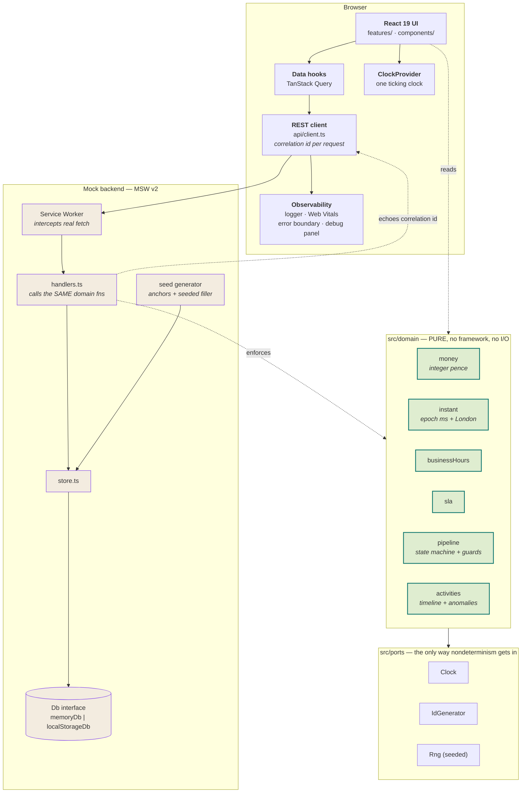

# System Analysis - Sales Center

**Keyloop Technical Assessment · Scenario C: Sales Lead Management Tool**

Service Implementation: **Frontend**, with the Backend mocked at the network boundary.

---

## 1. The problem, as Keyloop states it

> "Today, the average dealer uses 8–10 different systems just to close a deal, costing your team
> 5–10 hours each week in duplicated effort."
> \- _keyloop.com/sales-hub_

Two published numbers shaped what this application prioritises:

| Finding                                                | Source                 | What it implies                                |
| ------------------------------------------------------ | ---------------------- | ---------------------------------------------- |
| **20–30%** of enquiries are lost by never being logged | OC&C 2024, via Keyloop | Unworked leads must be _impossible to miss_    |
| **69%** of dealers cite rekeying and double entry      | OC&C 2024, via Keyloop | One record, one timeline; derive, never retype |

So the Lead Inbox is built as a **triage surface** rather than a table: it opens sorted by what is
about to go wrong, and it says out loud how many enquiries have never been touched.

---

## 2. System

### 2.1 System Analysis

Every dealership rule lives in `src/domain/` - pure TypeScript with no React, no `fetch`, no DOM, and no randomness. React is a thin renderer of domain output.

The payoff is that correctness becomes _demonstrable_. The SLA engine, the working-hours calendar
and the stage guards are all plain functions over plain data, unit-tested at 100%
coverage, and the _same functions_ run inside the mock API - so the rules cannot drift between what
the UI believes and what the server enforces.



### 2.2 What each part is responsible for

| Component               | Responsibility                             | Why separate                                          |
| ----------------------- | ------------------------------------------ | ----------------------------------------------------- |
| `src/domain/`           | Every dealership rule, as pure functions   | Testable without a browser; reused by the mock server |
| `src/ports/`            | `Clock`, `IdGenerator`, `Rng`              | The single channel for nondeterminism                 |
| `src/data/db.ts`        | `Db` seam, two implementations             | Makes "swappable" a passing contract suite            |
| `src/data/store.ts`     | Dealership-shaped reads and writes         | Keeps HTTP out of persistence                         |
| `src/mocks/handlers.ts` | The mock REST API                          | Runs the same domain functions as the UI              |
| `src/mocks/seed/`       | Fixed anchors + seeded filler              | Assertable fixtures _and_ realistic volume            |
| `src/api/client.ts`     | Real HTTP client, real URLs                | A real backend is a base-URL change                   |
| `src/app/`              | Providers, routing, shell, the one clock   | One interval drives every countdown                   |
| `src/features/`         | Screen composition only                    | Thin; the logic is a layer below                      |
| `src/observability/`    | Logger, correlation ids, Web Vitals, panel | Observability a reviewer can _see_                    |

---

## 3. The two problems worth explaining

### 3.1 The response clock counts working minutes

An enquiry arriving at **17:52 on a Friday**, eight minutes before the showroom closes, has not
breached a 30-minute target by Saturday morning. It has consumed eight working minutes and has
twenty-two left when the doors reopen.

Measuring against the wall clock instead would mark most of the overnight pipeline as breached, and
a team that sees a wall of false red learns to ignore the alert entirely - which costs exactly the
20–30% of never-worked leads the tool exists to prevent.

`businessHours.ts` therefore models opening hours, bank holidays and **Sunday trading** (most UK
franchised showrooms open on Sundays; treating Sunday as closed flatters every Friday-evening lead),
and provides a bounded local↔UTC inverse that handles both DST discontinuities:

- **Clocks go back** (25 Oct 2026): 01:30 local happens twice. The _first_ occurrence is returned.
- **Clocks go forward** (29 Mar 2026): 01:30 local never happens. The time clamps forward past the gap.

A naive two-pass correction silently returns the _second_ occurrence on a fall-back day, because
both passes converge on the post-transition offset. The implementation instead samples the offset
±24h to bracket any transition. This was found by a failing test, not by inspection - see
[docs/ai-collaboration/corrections.md](docs/ai-collaboration/corrections.md).

### 3.2 `cy.request` cannot reach MSW - so scenarios are set from the URL

This is the single most consequential implementation decision in the repository.

MSW runs as a **service worker inside the page**. `cy.request` is issued from **Cypress's Node
process**, so it never passes through that worker and can never reach a handler. Any design that
resets state with `cy.request('POST', '/__test__/reset')` silently does nothing: the call 404s
against the dev server, and every spec inherits whatever the previous spec left behind. The suite
still goes green, which is the dangerous part.

The reset therefore happens **in the page, before the worker starts and before React renders**,
driven by a URL contract (`src/bootstrap.ts`):

```
/inbox?__seed=sla-breach&__now=2026-09-19T08:15:00Z&__latency=400&__rngSeed=7
```

1. Parse the `__`-prefixed parameters.
2. Reset the store to that scenario.
3. `await worker.start()`.
4. _Only then_ render.

Race-free by construction, and it has a pleasant side effect: **every scenario is a shareable link**
a reviewer can open. `window.__testHooks` exists for mid-test manipulation only, and is gated on a
dedicated `VITE_E2E` flag - deliberately _not_ `import.meta.env.PROD`, because CI runs E2E against a
production preview build where `PROD` is true, which would make the test surface exist locally and
vanish in CI.

---

## 4. Technology choices

| Choice                           | Why                                                                                                   | Rejected                                          |
| -------------------------------- | ----------------------------------------------------------------------------------------------------- | ------------------------------------------------- |
| **React 19 + Vite 8**            | Internal tool behind a login: no SEO, no SSR to pay for                                               | Next.js - solves problems this app does not have  |
| **TypeScript 6.0.3**, max strict | `noUncheckedIndexedAccess` + `exactOptionalPropertyTypes` catch the bugs money and time code attracts | TS 7.0.2 - no programmatic API until 7.1          |
| **Radix + Tailwind v4**          | Focus traps, escape handling and ARIA are easy to get subtly wrong                                    | A styled kit - fights the design, adds weight     |
| **MSW v2**, the only mock        | Real HTTP to real URLs; one handler set serves dev, Cypress and Vitest                                | `json-server` - beta, second process, second mock |
| **TanStack Query**               | Caching and in-flight tracking is where bugs live; also gives E2E its quiescence signal               | Redux - almost no client state here               |
| **Vitest 4 + Cypress 15**        | See the Node constraint below                                                                         |                                                   |
| **Integer pence**                | Any chain of monetary operations drifts a penny once floats are involved                              | `Decimal.js` - integers already do this           |

---

## 5. Observability

| Layer                   | Implementation                                                      | Where you see it                          |
| ----------------------- | ------------------------------------------------------------------- | ----------------------------------------- |
| **Correlation ids**     | Minted per request, **echoed by every handler**                     | On the request and response log lines     |
| **Structured logging**  | `{level, msg, at, correlationId, ...}`; warn/error as one-line JSON | `docs/observability.md`                   |
| **Ring buffer + panel** | Last 200 records via `useSyncExternalStore`                         | **Telemetry** button, or `Ctrl` + `` ` `` |
| **Web Vitals**          | **LCP, INP, CLS, FCP, TTFB** into the same log                      | Panel, `web_vital` entries                |
| **Error boundaries**    | Log `ui.render_error` with the component stack                      | `ErrorBoundary.test.tsx`                  |
| **Fault injection**     | `?__latency=400&__errorRate=0.25`                                   | Every Nth write fails - reproducible      |

Ids are **sequential, not `crypto.randomUUID()`**, so a Cypress run is reproducible and a spec can
assert on a specific trace.

**In production** this is a transport swap: `logger`'s `emit` posts to an OTLP collector or Sentry,
and the correlation id becomes the trace id that joins the browser span to the backend span.

---

## 6. How GenAI was used in the design phase

The implementation narrative is in the
[README](README.md#ai-collaboration-narrative). This section covers **design**, where GenAI was used
differently - and where its output required the most scrutiny.

**The judges were instructed to recompute, not merely to opine.** That produced concrete findings:

- They recomputed every worked finance example and found arithmetic or formula errors in all three
  proposals. One quoted a PCP payment of £328.14 where its own formula produced £367.75. This work
  informed verification discipline even though the finance enhancement was later removed from the
  MVP.
- One judge identified that a proposed E2E strategy depended on `cy.request` reaching MSW, which it
  cannot do because Cypress sends that request from its Node process. That finding became §3.2 and
  changed the application's startup sequence.
- A proposed frozen demonstration clock landed on a Sunday morning outside the configured opening
  hours, which would have flattened the SLA countdowns the demo needed to show.

**Confident library claims were verified by execution.** Two research findings proved false when the
code ran: `eslint-plugin-react-hooks@7.1.1`'s `recommended-latest` configuration still used the legacy
ESLint shape, and `jsdom@30` excluded Node 25. A third assumption - that rendered `oklch()` contrast
could be predicted reliably with a naive sRGB conversion - failed near the gamut edge. In that case,
`cypress-axe` became the arbiter instead of the generated analysis.

**The resulting division of labour was deliberate.** GenAI was effective at breadth: enumerating UK
motor-retail vocabulary, drafting realistic seed data and generating exhaustive test cases. It was
less reliable for arithmetic and current library behaviour. The working rule therefore became:
**let GenAI propose, then require an independent mechanism to adjudicate.** The mutation sanity check,
accessibility gate, deterministic E2E contract and 144-pair pipeline table are retained examples of
that rule. The independent IRR oracle was another example and was retired with the finance engine
when the scope was reduced to the MVP.

---

## 7. What is built

| Capability                                             | Status                                                                |
| ------------------------------------------------------ | --------------------------------------------------------------------- |
| **Part A · Lead Inbox**                                | ✅ Triage bar, saved views, search, two sort orders                   |
| **Part A · Lead Details + chronological activity log** | ✅ Day-grouped timeline with anomaly surfacing                        |
| **Part A · Activity logging, persisted**               | ✅ Survives reload; proven by E2E                                     |
| **SLA working-hours engine**                           | ✅ Bank holidays, Sunday trading, both DST discontinuities            |
| **Pipeline state machine + guards with remedies**      | ✅ 144-pair table (12×12); stage moves from the lead record           |
| **Observability layer**                                | ✅ Correlation ids, structured logs, Web Vitals, in-app panel         |
| **Kanban pipeline board**                              | ✅ Keyboard-operable moves, guards with remedies, lost-reason capture |
| Deal Builder, Finance Engine, Scoring, Dashboard       | ❌ In the future                                                      |
