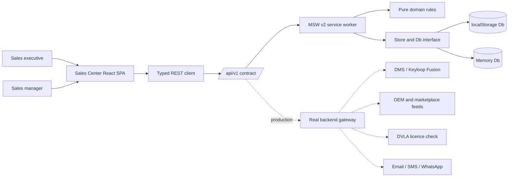
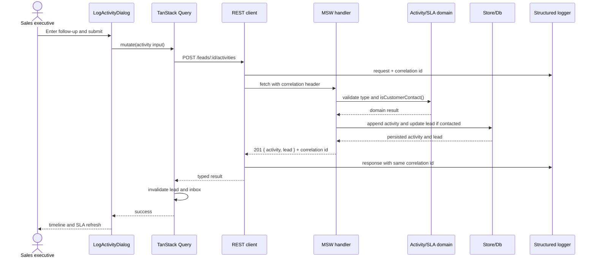
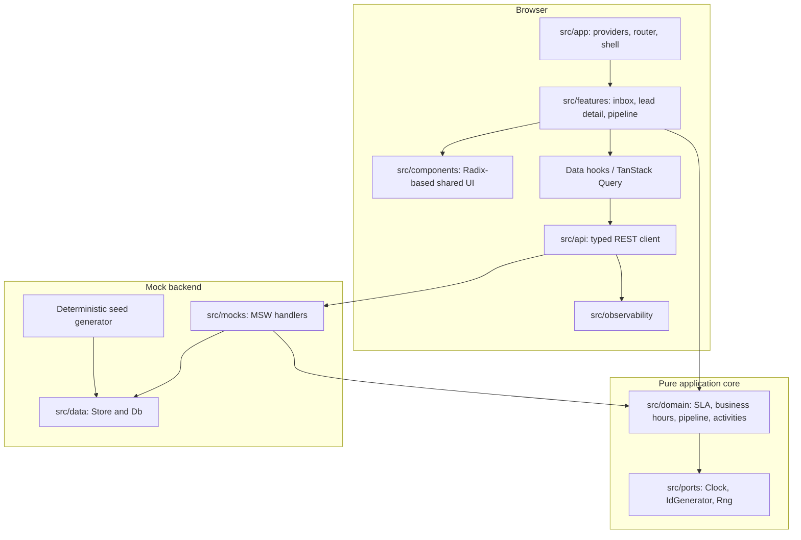
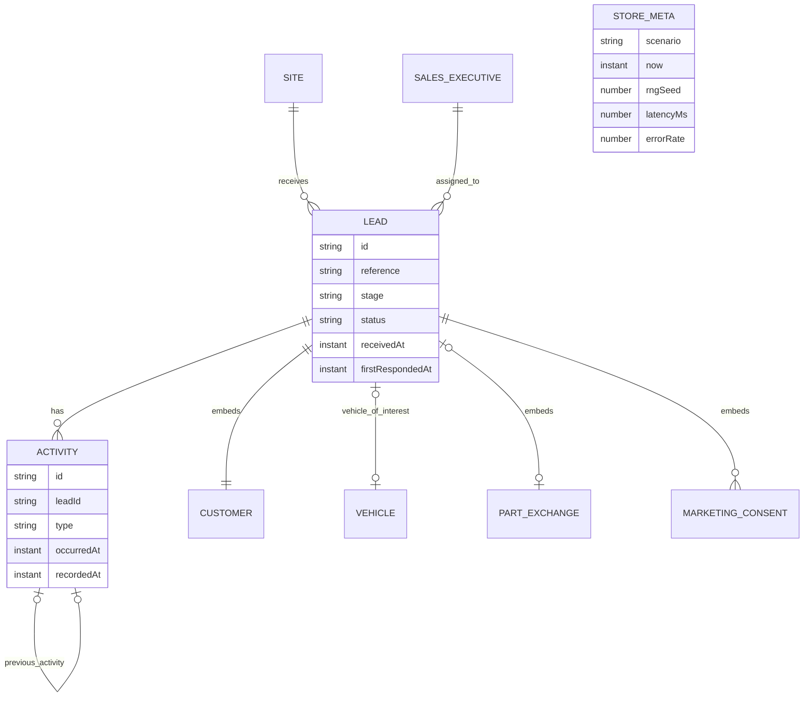

# System Design Document - Sales Center

**Keyloop Technical Assessment · Scenario C**

A sales lead management tool for a UK dealership group: one place to see every incoming enquiry,
work it, and prove it was worked. The frontend is implemented; the backend is mocked at the network
boundary.

## Contents

1. [Business Context](#1-business-context)
2. [High-Level Architecture](#2-high-level-architecture)
3. [Technical Decisions & Trade-offs](#3-technical-decisions--trade-offs)
4. [System Design Judgment](#4-system-design-judgment)
5. [Observability](#5-observability)
6. [How GenAI was used in the design phase](#6-how-genai-was-used-in-the-design-phase)
7. [Rollout](#7-rollout)

## 1. Business Context

### 1.1 The problem being solved

A dealership loses deals in the gap between an enquiry arriving and a salesperson acting on it.
Keyloop's published research shaped the product priorities:

| Finding          | What it means on the sales floor                                                               | What the product therefore does                                                                                      |
| ---------------- | ---------------------------------------------------------------------------------------------- | -------------------------------------------------------------------------------------------------------------------- |
| **20–30%**       | Enquiries are lost because they were never logged or followed up (OC&C 2024, cited by Keyloop) | Opens as a triage surface, sorted by what is about to breach, and shows how many enquiries have never been touched   |
| **69%**          | Dealers cite rekeying and double entry across systems (OC&C 2024, cited by Keyloop)            | Keeps one lead record and one timeline; SLA state, working minutes and triage counts are derived rather than retyped |
| **8–10 systems** | Used to close a deal, costing 5–10 hours per person per week (keyloop.com/sales-hub)           | Keeps the enquiry, its activity history and its pipeline stage on one record                                         |

#### For the sales executive

The first screen says what to do next. The response clock counts working minutes against actual
showroom hours, including Sunday trading and bank holidays. Logging a call takes one dialog and
persists immediately; genuine contact stops the SLA clock server-side from the activity itself.

#### For the sales manager

The pipeline board shows where each open deal is. Stage guards refuse moves the process does not
allow, so the board reflects the sales floor rather than a parallel spreadsheet. Reporting is kept
out of this phase until the underlying activity log is reliably complete.

#### For the business

| Value                                 | Mechanism                                                                   | How it would be measured in production                               |
| ------------------------------------- | --------------------------------------------------------------------------- | -------------------------------------------------------------------- |
| Revenue recovered from unworked leads | Unworked count is prominent; SLA chips escalate before breach               | Leads with zero customer contact after 24 working hours; target zero |
| Faster speed-to-lead                  | Working-minutes SLA per source; at-risk threshold at 25% remaining          | p50 / p90 minutes to first genuine contact, by source and executive  |
| Less admin, fewer errors              | One record and one timeline; derived figures are computed                   | Hours per executive per week on data entry; correction rate          |
| Auditable compliance                  | Chronological activity log; marketing consent with lawful basis per channel | FCA / GDPR audit sampling without manual reconstruction              |

### 1.2 In scope and out of scope for this phase

| In scope - built and verified                                                                | Out of scope                                           |
| -------------------------------------------------------------------------------------------- | ------------------------------------------------------ |
| Lead Inbox: triage bar, saved views, search, two sort orders and SLA chips                   | Deal Builder and finance engine                        |
| Lead Details with a chronological, day-grouped activity log and anomaly surfacing            | Manager analytics dashboard                            |
| Activity logging that persists across reloads                                                | Propensity scoring                                     |
| Working-hours SLA engine covering bank holidays, Sunday trading and both DST discontinuities | Real backend and database                              |
| Pipeline state machine and keyboard-operable Kanban board with guarded moves                 | Authentication, SSO and role-based permissions         |
| Correlation ids, structured logs, Web Vitals and an in-app telemetry panel                   | E-signature, quote sharing and predictive ML analytics |

## 2. High-Level Architecture

### 2.1 System Context Diagram

The Sales Center is a browser single-page application. During this phase, MSW v2 intercepts the
application's real `/api/v1/...` fetch calls inside the browser. The application code does not know
that its backend is mocked.

| External system            | What is needed                                      | Current behaviour and degradation if unavailable                              |
| -------------------------- | --------------------------------------------------- | ----------------------------------------------------------------------------- |
| DMS (Keyloop Fusion)       | Vehicle stock, customer master and order write-back | Seeded mock data. Production should degrade to read-only and queue write-back |
| OEM portals / marketplaces | Inbound enquiries with source attribution           | Seed generator produces them. Existing leads remain available if intake stops |
| DVLA licence check         | Licence validity before a test drive                | A dated activity models the result; fallback is a manually logged check       |
| Messaging gateway          | Email, SMS and WhatsApp delivery                    | Contact is logged, not sent. Production fallback is an outbox with retry      |

### 2.2 Data flow

Activity logging touches every layer. The mock handler asks the domain whether an activity is genuine
customer contact and stops the SLA clock server-side. Both the lead detail and inbox queries are then
invalidated because the new contact can change the SLA chip and triage counts.

### 2.3 Frontend component design

The frontend uses a layered, hexagonal shape adapted to a browser application. Every dealership rule
lives in `src/domain/` as pure TypeScript. React renders domain output; time, ids and randomness enter
only through injected ports.

| Module               | Responsibility                                            | Why it is separate                                       |
| -------------------- | --------------------------------------------------------- | -------------------------------------------------------- |
| `src/domain/`        | Dealership rules as pure functions                        | Testable without a browser and reused by the mock server |
| `src/ports/`         | `Clock`, `IdGenerator`, `Rng`                             | Single auditable channel for nondeterminism              |
| `src/data/`          | `Db` seam and two implementations                         | Makes swappable storage a passing contract suite         |
| `src/mocks/`         | MSW worker, handlers and deterministic seed               | Executable backend contract                              |
| `src/api/`           | HTTP client, URLs, correlation ids and typed errors       | Only module that knows HTTP exists                       |
| `src/app/`           | Providers, routing, shell and one ticking clock           | One interval drives every countdown                      |
| `src/features/`      | Screen composition                                        | Keeps business logic below the view layer                |
| `src/components/`    | Shared Radix-based UI primitives                          | Solves accessibility once                                |
| `src/observability/` | Logger, correlation, Web Vitals, error boundary and panel | Makes traces visible without devtools                    |

#### State ownership

TanStack Query owns server state. The URL owns shareable state such as `?view=`, `?sort=` and test
bootstrap parameters. Small UI state such as theme and panel visibility remains local component
state. Query's fetching and mutation counters provide Cypress with a real quiescence signal, so the
suite needs no `cy.wait()`.

### 2.4 Data model (Optional)

The model is lead-centric: `Lead` is the aggregate root, `Activity` is an append-only child
collection, `Site` and `SalesExecutive` are reference data, and `StoreMeta` is a singleton holding
the deterministic scenario clock. Customer, vehicle, part-exchange and consent are embedded value
objects so each enquiry preserves the facts as they were recorded.

### 2.5 APIs and interfaces (Optional)

The mock backend exposes eight endpoints under `/api/v1`. These form the executable contract for a
future real backend.

| Endpoint                         | Purpose                                                      | Success                           | Failure                                                                      |
| -------------------------------- | ------------------------------------------------------------ | --------------------------------- | ---------------------------------------------------------------------------- |
| `GET /reference`                 | Sites, executives and scenario metadata                      | `200 { sites, executives, meta }` | `503`                                                                        |
| `GET /leads`                     | Inbox filtering by status, site and assignee                 | `200 { leads, total }`            | `503`                                                                        |
| `GET /leads/:leadId`             | Lead and complete timeline                                   | `200 { lead, activities }`        | `404`, `503`                                                                 |
| `GET /leads/:leadId/activities`  | Timeline only                                                | `200 { activities }`              | `404`, `503`                                                                 |
| `POST /leads/:leadId/activities` | Log activity and possibly stop SLA via `isCustomerContact()` | `201 { activity, lead }`          | `404`, `422 INVALID_ACTIVITY_TYPE`, `503`                                    |
| `PATCH /leads/:leadId/stage`     | Move stage through `moveStage()`                             | `200 { lead }`                    | `404`, `422 UNKNOWN_STAGE` or guard, `503`                                   |
| `POST /leads/:leadId/close`      | Mark won or lost                                             | `200 { lead }`                    | `404`, `422 LOST_REASON_REQUIRED`, `HANDOVER_REQUIRED`, `LEAD_CLOSED`, `503` |
| `POST /leads/:leadId/reopen`     | Reopen through `reopenLead()`                                | `200 { lead }`                    | `404`, `422 LEAD_ALREADY_OPEN`, `503`                                        |

Success responses use named object fields rather than bare arrays. Failures use
`{ error: { code, message, remedy, details? } }`. The handler owns lookup and request-validation
errors; the domain owns business-rule and pipeline-guard errors.

## 3. Technical Decisions & Trade-offs

### 3.1 Frontend stack

| Layer        | Choice                               | Reason                                                                      |
| ------------ | ------------------------------------ | --------------------------------------------------------------------------- |
| Framework    | React 19                             | Mandated; concurrent rendering and `useSyncExternalStore` are used directly |
| Build tool   | Vite 8                               | Internal tool with no SEO or SSR requirement                                |
| Language     | TypeScript 6.0.3, maximum strictness | Catches unsafe indexing and optional-field mistakes                         |
| UI library   | Radix UI 1.6                         | Reliable focus, keyboard and ARIA behaviour                                 |
| CSS          | Tailwind CSS v4                      | Mandated CSS-first token system                                             |
| Server state | TanStack Query 5                     | Caching, invalidation and E2E quiescence signal                             |
| Routing      | React Router 8                       | URL-owned shareable state and demo scenarios                                |

### 3.2 Backend stack (mocked this phase)

| Concern         | Choice                                 | Reason                                                           |
| --------------- | -------------------------------------- | ---------------------------------------------------------------- |
| API mock        | MSW v2                                 | One network-boundary mock serves development, Vitest and Cypress |
| API surface     | Eight REST endpoints under `/api/v1`   | Executable contract for the backend team                         |
| Business rules  | Shared `src/domain` functions          | UI and server enforcement cannot drift                           |
| Persistence     | `localStorage` behind a `Db` interface | Persists activity while keeping storage replaceable              |
| Fixtures        | Deterministic seed generator           | Stable assertions plus credible data volume                      |
| Fault injection | `?__latency` and `?__errorRate`        | Makes failure and slowness reproducible                          |

### 3.3 Trade-offs - why A and not B

| Chose                              | Over                          | Why                                                | Cost accepted                                                           |
| ---------------------------------- | ----------------------------- | -------------------------------------------------- | ----------------------------------------------------------------------- |
| React + Vite                       | Next.js                       | No SEO, SSR or anonymous traffic                   | No server rendering or streaming                                        |
| Pure domain layer + ports          | Logic in components           | Rules are testable and reusable by the mock server | More files and indirection                                              |
| MSW v2                             | `json-server` or Express mock | Real fetch and one contract across test layers     | `cy.request` cannot reset service-worker state, requiring URL bootstrap |
| TanStack Query only                | Redux Toolkit plus Query      | Nearly all shared state is server state            | A future cross-screen UI concern may require a client store             |
| Integer pence and branded types    | Floating point or Decimal.js  | Exact arithmetic without another dependency        | Conversion ceremony at UI boundaries                                    |
| Radix + Tailwind                   | Full component kit            | Accessible primitives without fighting a theme     | More visual-layer code                                                  |
| Keyboard-first Kanban              | Pointer drag-and-drop         | Accessible and deterministic to automate           | Less visual spectacle in a demo                                         |
| Compatible pinned toolchain        | Latest majors                 | Works across Node 22, 24 and 25 without overrides  | Not every package is on its newest major                                |
| Query retries disabled in the demo | Automatic retry               | Fault injection remains visible and testable       | Production must add bounded retry                                       |

## 4. System Design Judgment

### 4.1 Bottlenecks - what fails first under a spike

| Pressure point                   | Risk             | What breaks                                                             | Mitigation                                                          |
| -------------------------------- | ---------------- | ----------------------------------------------------------------------- | ------------------------------------------------------------------- |
| `localStorage` store             | First            | Synchronous whole-collection writes cause jank and eventually hit quota | Replace through the existing `Db` seam with IndexedDB or a real API |
| `GET /leads` returns all matches | First            | Payload, sort and filtering grow with dealership size                   | Cursor pagination and server-side sorting                           |
| One-second tick across SLA chips | Large inbox      | Every countdown re-renders each second                                  | Virtualise rows and reduce tick frequency for distant targets       |
| Working-minutes calculation      | Bounded          | Day-by-day calculation repeats per lead per tick                        | Memoise by stable inputs                                            |
| Service worker boot              | Development only | Fixed interception cost                                                 | Removed when the real API lands                                     |

### 4.2 Dependency risk

| Dependency                | Risk     | Exposure                                               | Mitigation                                                                        |
| ------------------------- | -------- | ------------------------------------------------------ | --------------------------------------------------------------------------------- |
| Backend/data team         | Medium   | Contract mismatch creates integration rework           | Eight executable MSW contracts; adapter blast radius stays in `src/api/client.ts` |
| Identity/SSO team         | Low      | Authentication is not implemented                      | One HTTP client provides the insertion point for auth and 401 handling            |
| DMS team                  | Medium   | Stock, customer master and write-back belong elsewhere | Cache reads; queue and make writes idempotent                                     |
| DVLA and messaging        | Low      | Third-party availability                               | Manual checks and logged contact remain available                                 |
| Library vendors           | Low      | Framework and data-layer evolution                     | Widely adopted libraries; versions pinned and verified                            |
| Node 25 build environment | Resolved | Some current majors exclude odd Node releases          | Compatible versions and CI matrix coverage                                        |

### 4.3 Fallback plan

| Failure                          | Behaviour today                                                        | Production behaviour                                                                     |
| -------------------------------- | ---------------------------------------------------------------------- | ---------------------------------------------------------------------------------------- |
| Read request fails               | Typed error panel with remedy and correlation id; no retry in the demo | Three retries with exponential backoff and jitter, then stale cached data with timestamp |
| Activity write fails             | Dialog stays open with user input intact                               | Idempotency key, outbox and background reconciliation                                    |
| Business rule rejects an action  | `422` with code, message and actionable remedy                         | Unchanged                                                                                |
| Browser storage is unavailable   | Store degrades to memory and warns once                                | IndexedDB fallback plus outbox                                                           |
| Third party is unavailable       | Not called in this phase                                               | Degrade without blocking; queue work and circuit-break by partner                        |
| Component render fails           | Error boundary logs stack and renders recovery UI                      | Same, with remote telemetry transport                                                    |
| Service worker fails to register | Known demo gap can leave a blank page                                  | Catch startup rejection and render a static failure panel; worker absent in production   |

### 4.4 How these claims can be checked

| Command                   | What it demonstrates                                                                |
| ------------------------- | ----------------------------------------------------------------------------------- |
| `npm run verify`          | Typecheck, lint, determinism, 475 unit tests, 100% domain gate and production build |
| `npm run e2e`             | 58 Cypress specs across seven journeys, zero retries and no `cy.wait()`             |
| `npm run mutation-sanity` | Four domain constants are changed and the suite must fail                           |

## 5. Observability

| Layer                   | Implementation                                                               | Where you see it                          |
| ----------------------- | ---------------------------------------------------------------------------- | ----------------------------------------- |
| **Correlation ids**     | Minted per request and **echoed by every handler**                           | Request and response log lines            |
| **Structured logging**  | `{level, msg, at, correlationId, ...}`; warnings and errors as one-line JSON | `docs/observability.md`                   |
| **Ring buffer + panel** | Last 200 records via `useSyncExternalStore`                                  | **Telemetry** button, or `Ctrl` + `` ` `` |
| **Web Vitals**          | **LCP, INP, CLS, FCP, TTFB** in the same log                                 | Panel entries named `web_vital`           |
| **Error boundaries**    | Log `ui.render_error` with the component stack                               | `ErrorBoundary.test.tsx`                  |
| **Fault injection**     | `?__latency=400&__errorRate=0.25`                                            | Every Nth write fails reproducibly        |

Ids are **sequential, not `crypto.randomUUID()`**, so a Cypress run is reproducible and a spec can
assert on a specific trace.

**In production** this is a transport swap: `logger`'s `emit` posts to an OTLP collector or Sentry,
and the correlation id becomes the trace id that joins the browser span to the backend span.

## 6. How GenAI was used in the design phase

The implementation narrative is in the [README](README.md#ai-collaboration-narrative). This section
covers **design**, where GenAI was used differently - and where its output required the most scrutiny.

### The judges were instructed to recompute, not merely to opine

That produced concrete findings:

- They recomputed every worked finance example and found arithmetic or formula errors in all three
  proposals. One quoted a PCP payment of £328.14 where its own formula produced £367.75. This work
  informed verification discipline even though the finance enhancement was later removed from the
  MVP.
- One judge identified that a proposed E2E strategy depended on `cy.request` reaching MSW, which it
  cannot do because Cypress sends that request from its Node process. That finding became §3.2 and
  changed the application's startup sequence.
- A proposed frozen demonstration clock landed on a Sunday morning outside the configured opening
  hours, which would have flattened the SLA countdowns the demo needed to show.

### Confident library claims were verified by execution

Two research findings proved false when the code ran: `eslint-plugin-react-hooks@7.1.1`'s
`recommended-latest` configuration still used the legacy ESLint shape, and `jsdom@30` excluded Node 25. A third assumption - that rendered `oklch()` contrast could be predicted reliably with a naive
sRGB conversion - failed near the gamut edge. In that case, `cypress-axe` became the arbiter instead
of the generated analysis.

### The resulting division of labour was deliberate

GenAI was effective at breadth: enumerating UK motor-retail vocabulary, drafting realistic seed data
and generating exhaustive test cases. It was less reliable for arithmetic and current library
behaviour. The working rule therefore became: **let GenAI propose, then require an independent
mechanism to adjudicate.** The mutation sanity check, accessibility gate, deterministic E2E contract
and 144-pair pipeline table are retained examples of that rule. The independent IRR oracle was
another example and was retired with the finance engine when the scope was reduced to the MVP.

## 7. Rollout

### 7.1 Rollout Strategy

This phase has no production backend. The following plan applies when the real API is available.

| Stage              | Cohort                                        | Promotion condition                                                                             |
| ------------------ | --------------------------------------------- | ----------------------------------------------------------------------------------------------- |
| **0 · Dogfood**    | Developer plus one sales manager, seeded data | All E2E journeys pass on real showroom hardware and tablet                                      |
| **1 · Pilot site** | One dealership and all its executives         | p90 speed-to-lead no worse than incumbent; no lead unworked past 24 working hours; no P1 defect |
| **2 · One brand**  | Every site of one franchise brand             | Pilot metrics hold at about five times the volume; support contacts remain flat or fall         |
| **3 · Group**      | All sites                                     | Stage 2 metrics hold across every brand                                                         |

### 7.2 Resourcing

#### Resource allocation - one headcount

| Responsibility     | Owns                                                                 | Independent concern normally supplied by another role   |
| ------------------ | -------------------------------------------------------------------- | ------------------------------------------------------- |
| Frontend           | Screens, component layer, accessibility and theming                  | Design review and detection of logic leaking into views |
| Backend (mocked)   | Eight endpoints, persistence seam, seed generator and error contract | Backend feasibility review of the proposed contract     |
| Automation testing | 475 unit tests, 58 E2E specs, coverage gate and CI                   | A tester challenging assumptions independently          |
